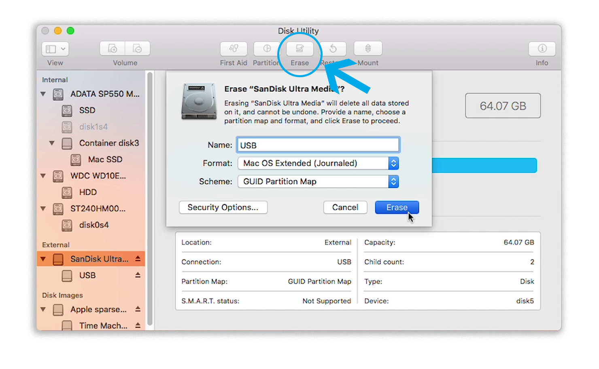
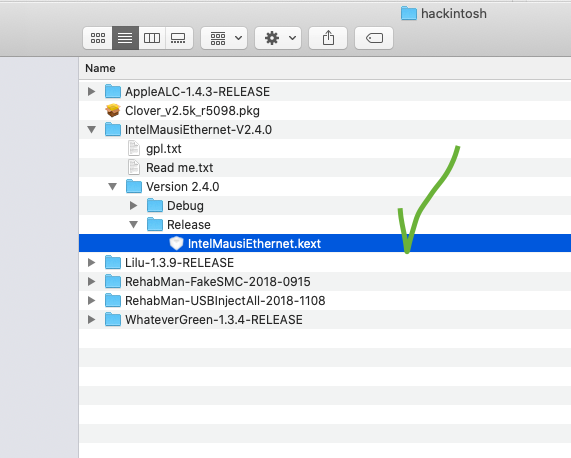
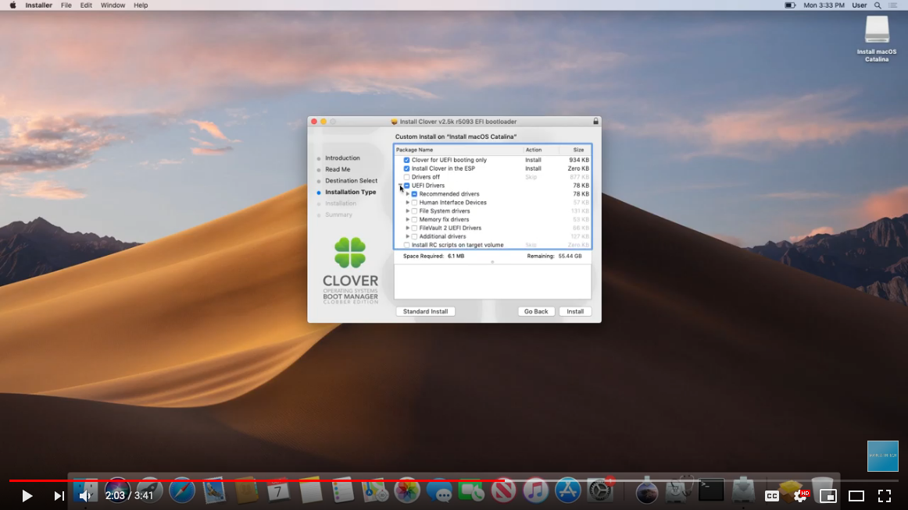
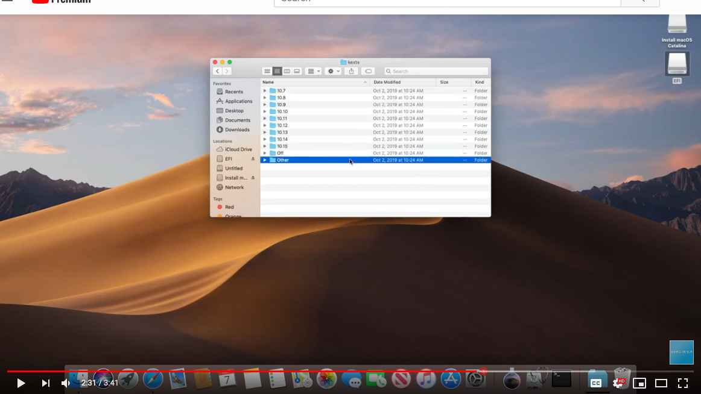
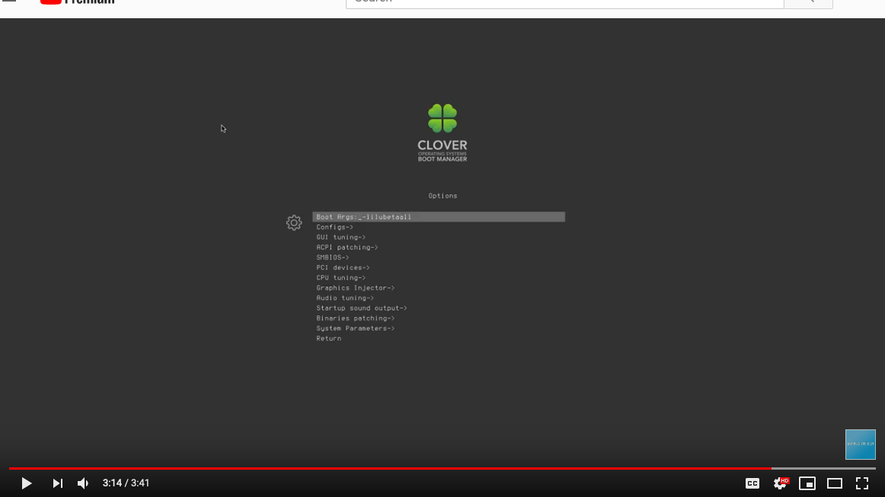

# Hackintosh Build Guide for OSX Catalina - 10.15

> tldr; Hackintosh Guide for Catalina on my custom built PC

## Prerequisites

- 16GB USB Drive
- OSX Catalina from the App Store
- 🤞 Lots of patience

## My System Specs


- NZXT Tempest 210 case
- GIGABYTE GA-Z87X-D3H motherboard
- Intel Core i5-4670K Haswell 3.4GHz
- Intel HD Graphics 4600 1536 MB
- 16GB 1600mhz DDR3 memory
- Corsair CX500 Power Supply
- (2)256 SSD and 1TB HD

Hard to believe this build was from January 2014 and is still running great.

> Hackintoshes are very picky on hardware so make sure you choose wisely.<br/> [Tonymacx86 Buyers Guide][buyersguide] is a great resource to choose from guaranteed working builds.

## Step One: Make a Catalina Bootable USB (the mac approved way)

<a href="http://www.youtube.com/watch?feature=player_embedded&v=ekp8w6pel84
" target="_blank"></a>

<figcaption>
  Great video explaining the process
</figcaption>

1. You will need to have a copy of Catalina from the App store.
2. Format USB Drive to `MacOS Extended(Journaled)`. Set Scheme to `GUID Partition Map` and name it `USB`.
   
3. Open Terminal and run:

```sh

sudo /Applications/Install\ macOS\ Catalina.app/Contents/Resources/createinstallmedia --nointeraction --downloadassets --volume /Volumes/USB/

```

> ☕ this process takes a while (like really long maybe 15-30 mins) so get a coffee refill

## Step Two: Clover Configuration on your USB

> Clover configuration is a two part process. You'll have to do it once on the USB Drive and then again on the install drive post-install.

### Get Clover and your kexts(drivers for mac)

#### Minimum

- [Clover Bootloader](https://github.com/Dids/clover-builder/releases)
- [FakeSMC.kext](https://bitbucket.org/RehabMan/os-x-fakesmc-kozlek/downloads/)
- [USBInjectAll.kext](https://bitbucket.org/RehabMan/os-x-usb-inject-all/downloads/)
- [Lilu.kext](https://github.com/acidanthera/Lilu/releases)
- [WhateverGreen.kext](https://github.com/acidanthera/WhateverGreen/releases)

#### Extras for my build

- [IntelMausiEthernet 2.5.0](https://www.insanelymac.com/forum/files/file/396-intelmausiethernet/)
- [Apple ALC Sound](https://github.com/acidanthera/AppleALC/releases)



Most of these are zip files so extract them and look for the file extension `.kext`.

### USB Drive Config

> Had some issues with clover on my MacBoook Pro [so I followed this guide to disable SIP](https://www.reddit.com/r/hackintosh/comments/d9pbhy/clover_cannot_install_wo_ensuring_file_system_is/)

```text
FIX: Click the Apple symbol in the Menu bar.
Click Restart…
Hold down Command-R to reboot into Recovery Mode.
Click Utilities.
Select Terminal.
Type `csrutil disable`.
Press Return or Enter on your keyboard.
Click the Apple symbol in the Menu bar.
Click Restart…
```

> make sure you re-able SIP after you are done by running `csrutil enable` reversing the process above

1. Make sure your USB Drive is inserted.
2. run the `clover_version_rev.pkg` that you downloaded.
3. On the Destination Select tab, click on the option Change Install Location.
4. Select the USB Flash Drive.
   
5. Now on the Installation Type Tab Click on the Customize option.
   

### Copying Files to EFI partition on Hackintosh macOS Catalina USB Installer



Open up the EFI partition (location: /Volumes/EFI/), and navigate to "EFI", then to "CLOVER". Then, navigate to the "kexts" folder, then to "Other".

You should be in the directory /Volumes/EFI/CLOVER/kexts/Other/. In here, you'll want to drop in the required Kexts as well as any other Kexts you need for your system.

## Step Three: Install macOS Catalina from new bootable USB

1. Boot from your new USB Drive (on USB2 port).
2. From the clover menu, enter option `o` and enter `-lilubetaall` on the Boot Args option and then **Return**
   
3. Boot from macOS Intall option
4. and when it boots up, Go to `Disk Utilty` and format your SSD to use `APFS`.
5. Install macOS Catalina.

- During installation process the macOS will reboot several times.

- remember to select boot from Catalina if its not already selected

## Step Four: Post-Install

1. Now you will need to do the Clover EFI steps again but this time to your new Catalina SSD. Follow same steps as in Step 2 but choose Catalina SSD rather than the USB Drive.

## Credits

### [GUIDE - Create Catalina 10.14 Hackintosh USB Installer](https://markwithtech.com/Thread-GUIDE-Create-Catalina-10-15-Hackintosh-USB-Installer)

[buyersguide]: https://www.tonymacx86.com/buyersguide/building-a-customac-hackintosh-the-ultimate-buyers-guide/
