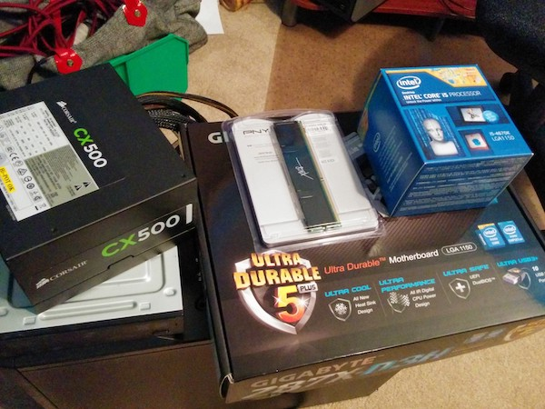

# Hackintosh Build Guide for OSX Catalina - 10.15

> tldr; Hackintosh Guide for Catalina on my custom built PC

## Prerequisites

- 8GB USB Drive
- OSX Catalina from the App Store
- 🤞 Lots of patience

## My System Specs



- NZXT Tempest 210 case
- GIGABYTE GA-Z87X-D3H motherboard
- Intel Core i5-4670K Haswell 3.4GHz
- Intel HD Graphics 4600 1536 MB
- 16GB 1600mhz DDR3 memory
- Corsair CX500 Power Supply
- (2)256 SSD and 1TB HD

Hard to believe this build was from January 2014 and is still running great.

> Hackintoshes are very picky on hardware so make sure you choose wisely.<br/> [Tonymacx86 Buyers Guide][buyersguide] is a great resource to choose from guaranteed working builds.

## Step One: Bootable USB

<a href="http://www.youtube.com/watch?feature=player_embedded&v=ekp8w6pel84
" target="_blank"></a>

<figcaption>
  Great video explaining the process
</figcaption>

1. You will need to have a copy of Catalina from the App store.
2. Format USB Drive to `MacOS Extended(Journaled)` and name it `USB`.
   
3. Open Terminal and run:

```terminal
sudo /Applications/Install\ macOS\ Catalina.app/Contents/Resources/createinstallmedia --volume /Volumes/USB/
```

## Step Two: Clover Configuration

Clover configuration is a two part process. You'll have to do it once on the USB Drive and then again on the install drive. [TechHowdy][techhowdy] has a great guide for this.

### USB Drive Config

1. [Download Clover EFI Bootloader][clover]
2. Make sure your USB Drive is inserted.
3. On the Destination Select tab, click on the option Change Install Location.
4. Select the USB Flash Drive.
5. Now on the Installation Type Tab Click on the Customize option. Select the option Install for UEFI booting only.
6. Click on the Dropdown for Drivers64UEFI and Select the following options:


- AppleImageCodec-64.UEFI
- AppleKeyAggregator-64.UEFI
- AppleUITheme-64.UEFI
- DataHubDxe-64.UEFI
- FirmwareVolume-64.UEFI
- FSInject-64.UEFI
- SMCHelper-64.UEFI
- VboxHfs-64.UEFI
- Apfs
- OsxAptioFix2Drv-64
- PartitionDxe-64

### Copying Files to EFI partition on Hackintosh macOS Catalina USB Installer

1. Go to Finder and open mounted EFI. Now open the folder EFI > Clover > drivers64.
1. Copy the [apfs.efi][apfs] file in `drivers64` and the `drivers64UEFI` folder.
1. Now go back to the `Clover` folder and open the `kexts/Other` folder.
1. Copy the [kexts][kextslink] in the `Other` folder.
1. Now go back to Clover folder and Delete `config.plist` file and Paste the empty `config.plist` [file][emptyconfig].

## Step Three: Install

1. Boot from your new USB Drive (on USB2 port) and when it boots up, Go to `Disk Utilty` and format your SSD to use `APFS`.
2. Install MacOSX Catalina.
   -During installation process the Mac OS will reboot several Times.

## Step Four: Post-Install

1. Now you will need to do Clover EFI steps again but this time to your new Catalina SSD. Follow same steps as in Step 2 but choose Catalina SSD rather than the USB Drive.
2. I had issues with Intel 4600 video and sound drivers.

- Sound Issues with my [ALC 892 kexts solution][alcsound]. I've added the sound kexts and Lilu so hope this won't be an issue.
- Video issue was not using 2K screen to full resolution. Solution was found in this [YouTube Video][intel4600youtube] that describes using Clover Configuration to tweak video settings.

3. Save Clover Configuration and reboot to make sure everything is working.

## Credits

### [Step By Step Process To Install Hackintosh macOS Catalina][catalinainstallguide]

### [GUIDE - Create Catalina 10.14 Hackintosh USB Installer](https://markwithtech.com/d/183-guide-create-Catalina-10-14-hackintosh-usb-installer)

[githubssh]: https://help.github.com/articles/connecting-to-github-with-ssh/
[nightowliterm]: https://github.com/nickcernis/iterm2-night-owl
[intel4600youtube]: https://youtu.be/sL3JmGvbAxQ
[catalinainstallguide]: http://techhowdy.com/process-to-install-hackintosh-macos-Catalina/
[alcsound]: https://www.reddit.com/r/hackintosh/comments/4e23w6/guide_native_audio_with_clover_applealckext/
[homebrewfonts]: https://github.com/Homebrew/homebrew-cask-fonts
[googleplus]: https://plus.google.com/+FrankPigeon/posts/H5Cm7CXGwxs
[buyersguide]: https://www.tonymacx86.com/buyersguide/building-a-customac-hackintosh-the-ultimate-buyers-guide/
[clover]: https://sourceforge.net/projects/cloverefiboot/
[cloverconfig]: https://mackie100projects.altervista.org/download-clover-configurator/
[techhowdy]: http://techhowdy.com/process-to-install-hackintosh-macos-Catalina/
[apfs]: https://drive.google.com/open?id=1Rwtarw3zTXAXsBP6a9Aadul84lNR4x1R
[kextslink]: https://drive.google.com/open?id=1cCO6xVnCuIPAQzBP4YQVnmZDNTevZJWE
[emptyconfig]: https://drive.google.com/open?id=1C7ZITyMw41I2yc_RoZR3apoR3C8eud1K
